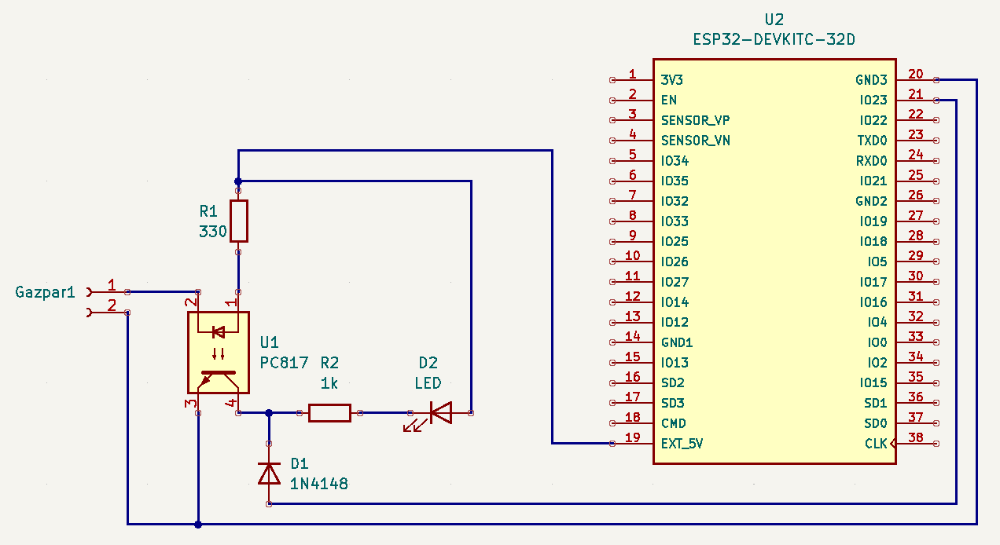

# Gazpar

> Remonter la consommation de gaz sur Home Assistant via ESPHome.

## Mise en garde

J'ai préféré, par sécurité, déporter l'installation électronique de mon compteur de gaz. J'ai utilisé un cable de 10m allant du compteur Gazpar jusqu'à mon garage où j'y ai installé l'ESP et le circuit.

A défaut, je pense qu'il faut un autre montage, moins énergivore (à base d'attiny85 qui fait le comptage, et faire réveiller l'esp toute les heures pour qu'il transmette le relevé à Home assistant), et mettre le tout sur pile/batterie, dans un boitier hermétique.

⚠️ Quoi qu'il en soit, n'amenez jamais du 220V dans la niche du compteur, d'un manière où d'un autre.

## Liste de course

Pour le PCB fourni :

- Alimentation 5V
- U1 : Opto PC817 (ou EL817)
- U2 : [ESP-01S](https://www.amazon.fr/AZDelivery-ESP8266-Arduino-Raspberry-microcontr%C3%B4leur/dp/B01LK83TX0)
- U3 : [Module réducteur de tension](https://www.amazon.fr/gp/product/B07MY2NMQ6) basé sur un AMS1117 (l'ESP-01 fonctionne sur du 3.3V)
- R1 : résistance 330 ohm 1/4W
- R2 : résistance 1K ohm 1/4W
- D1 : diode de redressement 1N4148
- Une led (débug, s'allumera à chaque pulse)
- [Cable JAE Gazpar](https://www.gce-electronics.com/fr/divers/1612-connecteur-jae-pour-compteur-gazpar.html)

## Schéma électronique

Le schéma et le PCB sont dispo dans le dossier [gazpar-kicad](./gazpar-kicad).

## Références

- [Gazpar/Espeasy](https://community.jeedom.com/t/tuto-module-gazpar-pour-espeasy/46489)
- [Récupération Gazpar dans Home Assistant](https://forum.hacf.fr/t/recuperation-telesignalisation-gazpar/5930)
